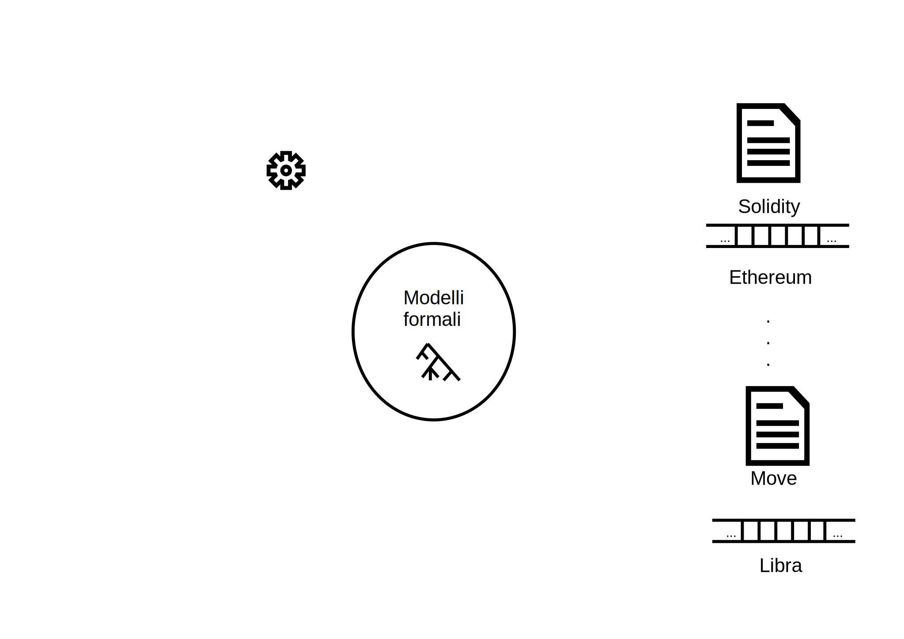
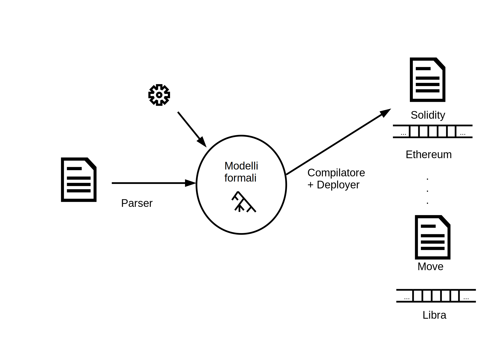
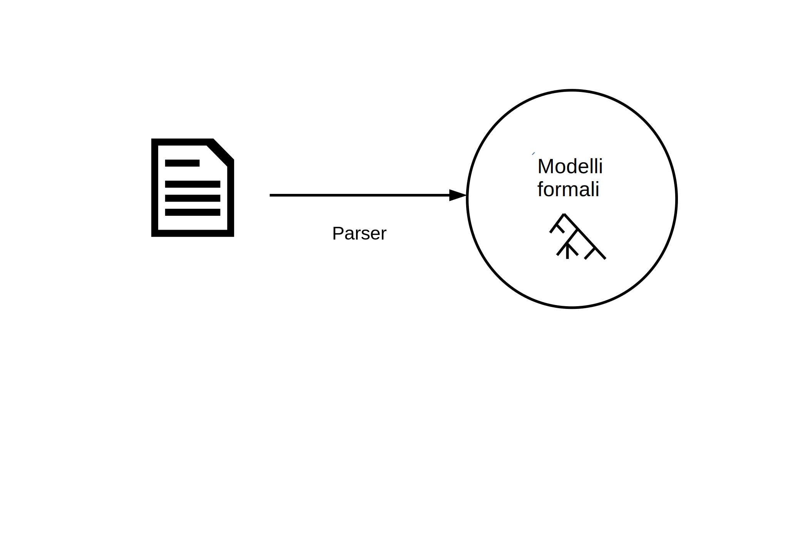
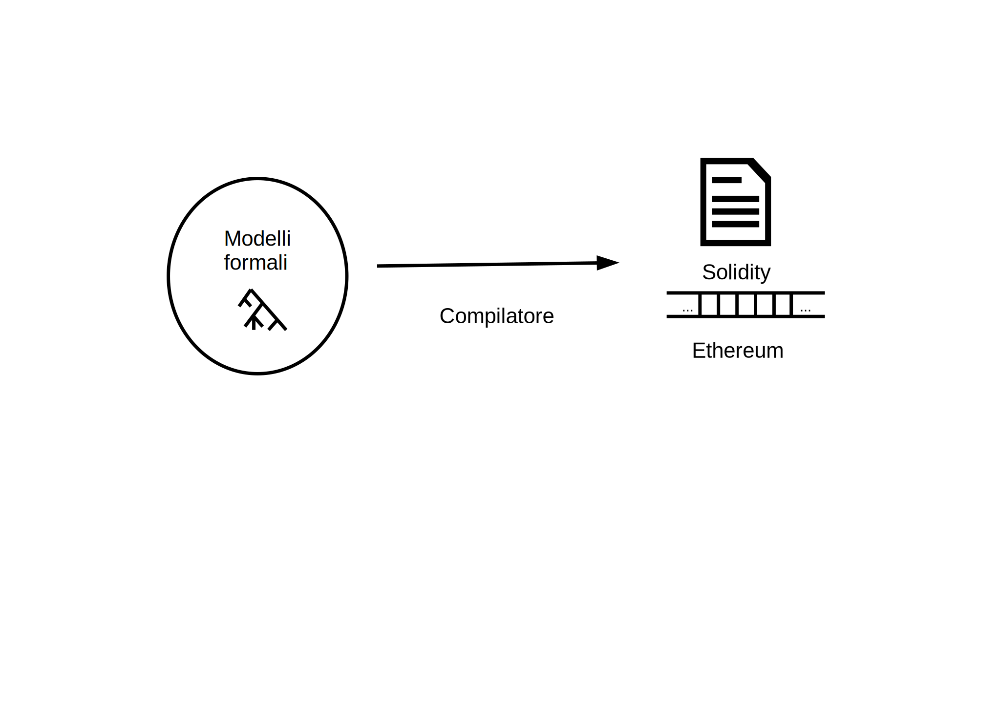

---
title:
    - Un compilatore per un linguaggio per smart contract intrinsecamente tipato

short-title:
    - Un compilatore per un linguaggio per smart contract

author:
    - Stefano Bucciarelli 

theme:
    - Copenhagen

---

# Descrizione smart contract

 

# Analisi su smart contract

# Analisi su smart contract

# Intrinsically Typed Data Structure

# Parsing

+ Parsing = Parser + Type checking
+ Parser combinator

# Compilazione e deploy

+ Compilazione tramite la costruzione di un AST intrinsecamente tipato per Solidity
+ Inferenza di interfacce
+ Script Python per il deploy

# Compilazione e deploy

+ Compilazione tramite la costruzione di un AST intrinsecamente tipato per Solidity
+ Inferenza di interfacce
+ Script Python per il deploy

# Lavoro svolto

+ Risultati
+ 1400 righe di codice OCaml

# Futuri lavori

+ Codice Python per umani
+ Analisi statiche
    + Modelli differenti
    + Modularità
